# TradingAgents アーキテクチャドキュメント

このドキュメントでは、TradingAgentsの詳細なアーキテクチャを図解と共に説明します。

## 目次
1. [システム全体図](#システム全体図)
2. [データフロー](#データフロー)
3. [エージェント間の通信](#エージェント間の通信)
4. [状態管理](#状態管理)
5. [メモリシステム](#メモリシステム)
6. [実行フロー](#実行フロー)

---

## システム全体図

### 高レベルアーキテクチャ

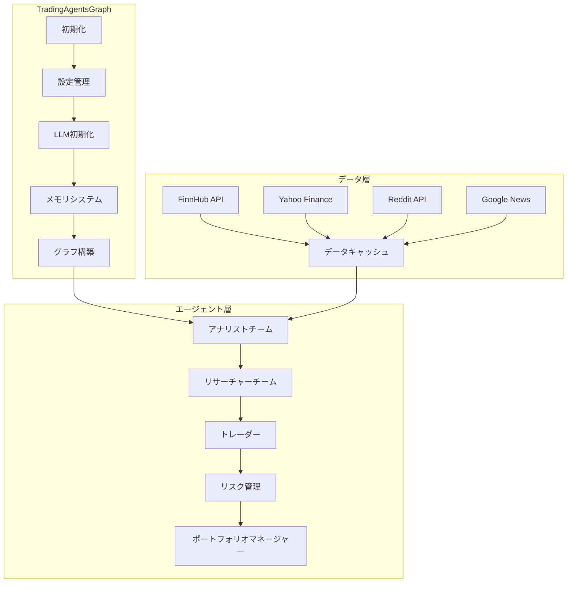
```mermaid
graph TB
    subgraph "TradingAgentsGraph"
        Init[初期化]
        Config[設定管理]
        LLM[LLM初期化]
        Memory[メモリシステム]
        Graph[グラフ構築]
    end
    
    subgraph "データ層"
        FinnHub[FinnHub API]
        YFinance[Yahoo Finance]
        Reddit[Reddit API]
        GoogleNews[Google News]
        Cache[データキャッシュ]
    end
    
    subgraph "エージェント層"
        Analysts[アナリストチーム]
        Researchers[リサーチャーチーム]
        Trader[トレーダー]
        RiskMgmt[リスク管理]
        Portfolio[ポートフォリオマネージャー]
    end
    
    Init --> Config
    Config --> LLM
    LLM --> Memory
    Memory --> Graph
    
    Graph --> Analysts
    Analysts --> Researchers
    Researchers --> Trader
    Trader --> RiskMgmt
    RiskMgmt --> Portfolio
    
    FinnHub --> Cache
    YFinance --> Cache
    Reddit --> Cache
    GoogleNews --> Cache
    Cache --> Analysts
```

### エージェント詳細図

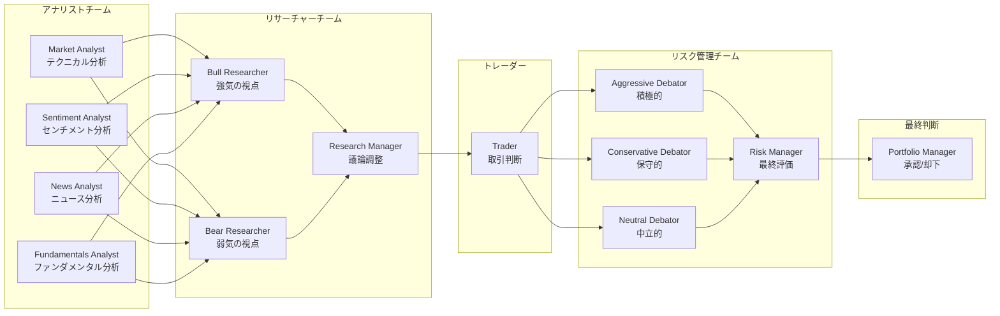
```mermaid
graph LR
    subgraph "アナリストチーム"
        MA[Market Analyst<br/>テクニカル分析]
        SA[Sentiment Analyst<br/>センチメント分析]
        NA[News Analyst<br/>ニュース分析]
        FA[Fundamentals Analyst<br/>ファンダメンタル分析]
    end
    
    subgraph "リサーチャーチーム"
        Bull[Bull Researcher<br/>強気の視点]
        Bear[Bear Researcher<br/>弱気の視点]
        RM[Research Manager<br/>議論調整]
    end
    
    subgraph "トレーダー"
        T[Trader<br/>取引判断]
    end
    
    subgraph "リスク管理チーム"
        Agg[Aggressive Debator<br/>積極的]
        Con[Conservative Debator<br/>保守的]
        Neu[Neutral Debator<br/>中立的]
        RMgr[Risk Manager<br/>最終評価]
    end
    
    subgraph "最終判断"
        PM[Portfolio Manager<br/>承認/却下]
    end
    
    MA --> Bull
    SA --> Bull
    NA --> Bull
    FA --> Bull
    
    MA --> Bear
    SA --> Bear
    NA --> Bear
    FA --> Bear
    
    Bull --> RM
    Bear --> RM
    RM --> T
    
    T --> Agg
    T --> Con
    T --> Neu
    
    Agg --> RMgr
    Con --> RMgr
    Neu --> RMgr
    
    RMgr --> PM
```

---

## データフロー

### データ取得フロー

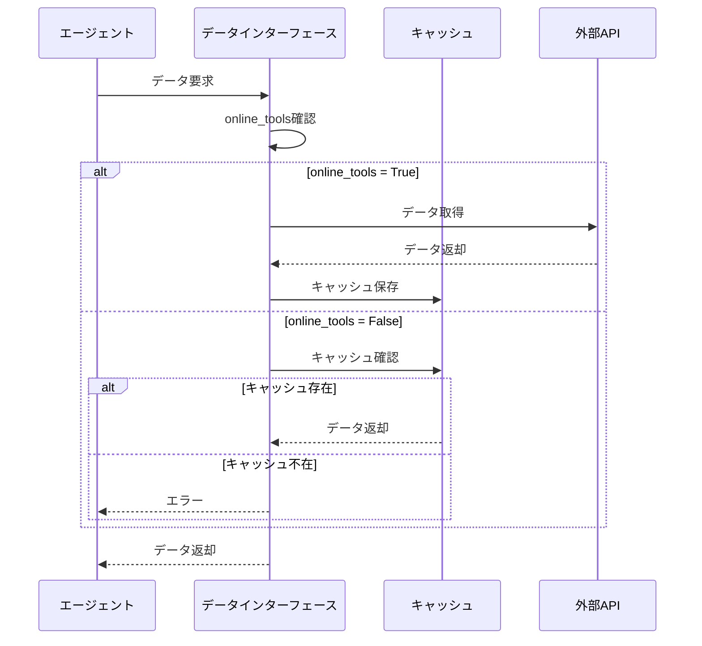
```mermaid
sequenceDiagram
    participant Agent as エージェント
    participant Interface as データインターフェース
    participant Cache as キャッシュ
    participant API as 外部API
    
    Agent->>Interface: データ要求
    Interface->>Interface: online_tools確認
    
    alt online_tools = True
        Interface->>API: データ取得
        API-->>Interface: データ返却
        Interface->>Cache: キャッシュ保存
    else online_tools = False
        Interface->>Cache: キャッシュ確認
        alt キャッシュ存在
            Cache-->>Interface: データ返却
        else キャッシュ不在
            Interface-->>Agent: エラー
        end
    end
    
    Interface-->>Agent: データ返却
```

### データ処理パイプライン

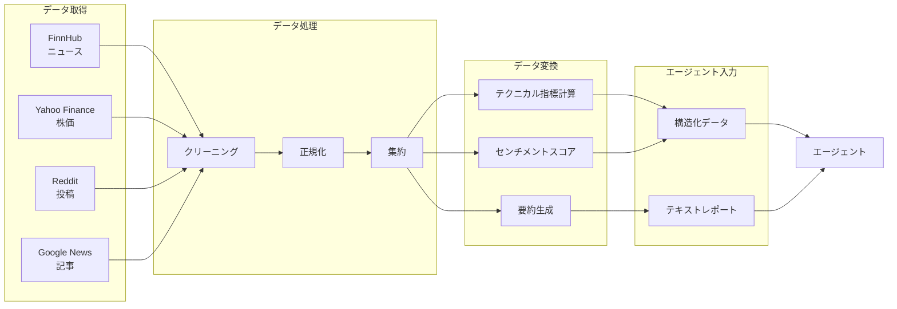
```mermaid
graph LR
    subgraph "データ取得"
        A1[FinnHub<br/>ニュース]
        A2[Yahoo Finance<br/>株価]
        A3[Reddit<br/>投稿]
        A4[Google News<br/>記事]
    end
    
    subgraph "データ処理"
        B1[クリーニング]
        B2[正規化]
        B3[集約]
    end
    
    subgraph "データ変換"
        C1[テクニカル指標計算]
        C2[センチメントスコア]
        C3[要約生成]
    end
    
    subgraph "エージェント入力"
        D1[構造化データ]
        D2[テキストレポート]
    end
    
    A1 --> B1
    A2 --> B1
    A3 --> B1
    A4 --> B1
    
    B1 --> B2
    B2 --> B3
    
    B3 --> C1
    B3 --> C2
    B3 --> C3
    
    C1 --> D1
    C2 --> D1
    C3 --> D2
    
    D1 --> E[エージェント]
    D2 --> E
```

---

## エージェント間の通信

### LangGraphの状態遷移

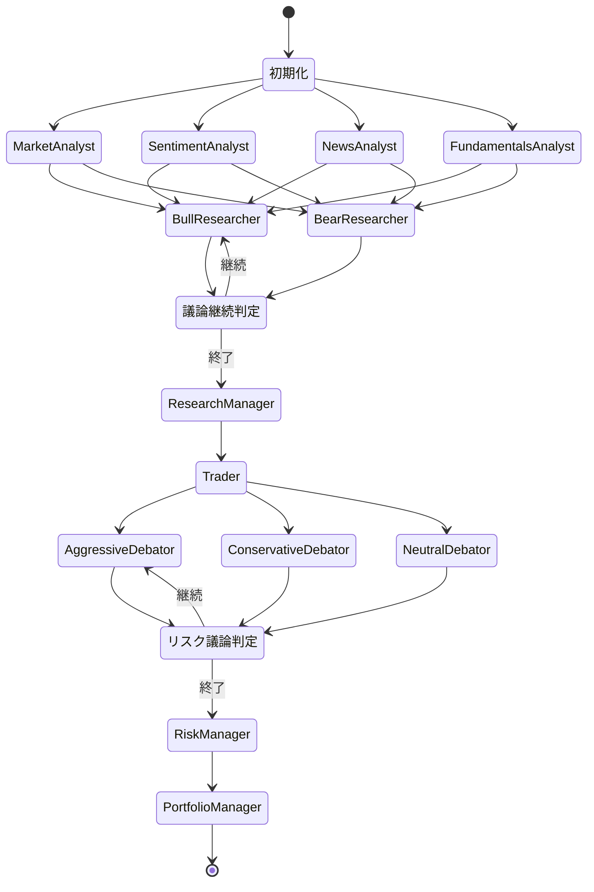
```mermaid
stateDiagram-v2
    [*] --> 初期化
    初期化 --> MarketAnalyst
    初期化 --> SentimentAnalyst
    初期化 --> NewsAnalyst
    初期化 --> FundamentalsAnalyst
    
    MarketAnalyst --> BullResearcher
    SentimentAnalyst --> BullResearcher
    NewsAnalyst --> BullResearcher
    FundamentalsAnalyst --> BullResearcher
    
    MarketAnalyst --> BearResearcher
    SentimentAnalyst --> BearResearcher
    NewsAnalyst --> BearResearcher
    FundamentalsAnalyst --> BearResearcher
    
    BullResearcher --> 議論継続判定
    BearResearcher --> 議論継続判定
    
    議論継続判定 --> BullResearcher: 継続
    議論継続判定 --> ResearchManager: 終了
    
    ResearchManager --> Trader
    Trader --> AggressiveDebator
    Trader --> ConservativeDebator
    Trader --> NeutralDebator
    
    AggressiveDebator --> リスク議論判定
    ConservativeDebator --> リスク議論判定
    NeutralDebator --> リスク議論判定
    
    リスク議論判定 --> AggressiveDebator: 継続
    リスク議論判定 --> RiskManager: 終了
    
    RiskManager --> PortfolioManager
    PortfolioManager --> [*]
```

### メッセージパッシング

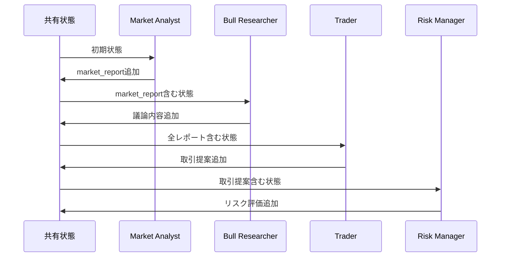
```mermaid
sequenceDiagram
    participant State as 共有状態
    participant MA as Market Analyst
    participant Bull as Bull Researcher
    participant Trader as Trader
    participant Risk as Risk Manager
    
    State->>MA: 初期状態
    MA->>State: market_report追加
    
    State->>Bull: market_report含む状態
    Bull->>State: 議論内容追加
    
    State->>Trader: 全レポート含む状態
    Trader->>State: 取引提案追加
    
    State->>Risk: 取引提案含む状態
    Risk->>State: リスク評価追加
```

---

## 状態管理

### AgentState構造

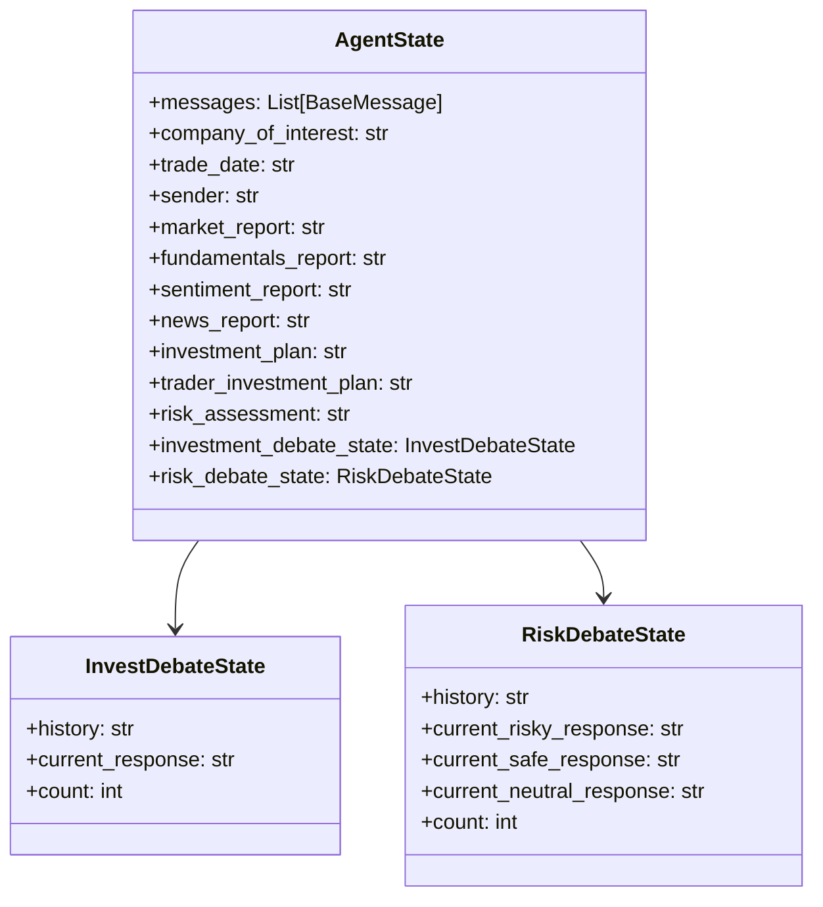
```mermaid
classDiagram
    class AgentState {
        +messages: List[BaseMessage]
        +company_of_interest: str
        +trade_date: str
        +sender: str
        +market_report: str
        +fundamentals_report: str
        +sentiment_report: str
        +news_report: str
        +investment_plan: str
        +trader_investment_plan: str
        +risk_assessment: str
        +investment_debate_state: InvestDebateState
        +risk_debate_state: RiskDebateState
    }
    
    class InvestDebateState {
        +history: str
        +current_response: str
        +count: int
    }
    
    class RiskDebateState {
        +history: str
        +current_risky_response: str
        +current_safe_response: str
        +current_neutral_response: str
        +count: int
    }
    
    AgentState --> InvestDebateState
    AgentState --> RiskDebateState
```

### 状態の更新フロー

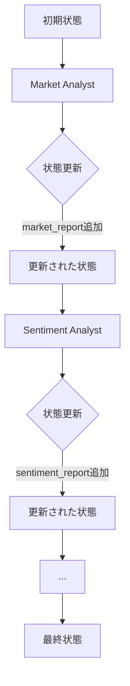
```mermaid
graph TD
    A[初期状態] --> B[Market Analyst]
    B --> C{状態更新}
    C -->|market_report追加| D[更新された状態]
    
    D --> E[Sentiment Analyst]
    E --> F{状態更新}
    F -->|sentiment_report追加| G[更新された状態]
    
    G --> H[...]
    H --> I[最終状態]
```

---

## メモリシステム

### ChromaDBアーキテクチャ

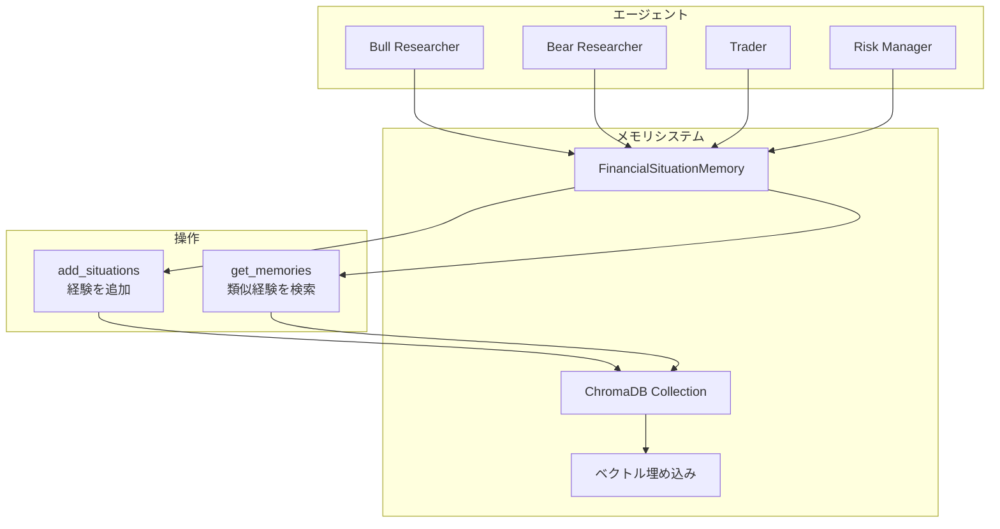
```mermaid
graph TB
    subgraph "メモリシステム"
        A[FinancialSituationMemory]
        B[ChromaDB Collection]
        C[ベクトル埋め込み]
    end
    
    subgraph "エージェント"
        D[Bull Researcher]
        E[Bear Researcher]
        F[Trader]
        G[Risk Manager]
    end
    
    subgraph "操作"
        H[add_situations<br/>経験を追加]
        I[get_memories<br/>類似経験を検索]
    end
    
    D --> A
    E --> A
    F --> A
    G --> A
    
    A --> H
    A --> I
    
    H --> B
    I --> B
    
    B --> C
```

### メモリの保存と検索

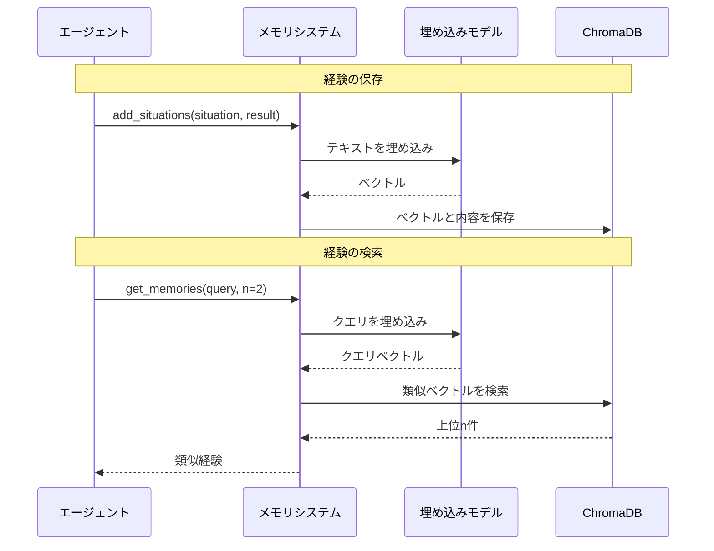
```mermaid
sequenceDiagram
    participant Agent as エージェント
    participant Memory as メモリシステム
    participant Embed as 埋め込みモデル
    participant DB as ChromaDB
    
    Note over Agent,DB: 経験の保存
    Agent->>Memory: add_situations(situation, result)
    Memory->>Embed: テキストを埋め込み
    Embed-->>Memory: ベクトル
    Memory->>DB: ベクトルと内容を保存
    
    Note over Agent,DB: 経験の検索
    Agent->>Memory: get_memories(query, n=2)
    Memory->>Embed: クエリを埋め込み
    Embed-->>Memory: クエリベクトル
    Memory->>DB: 類似ベクトルを検索
    DB-->>Memory: 上位n件
    Memory-->>Agent: 類似経験
```

---

## 実行フロー

### propagate()メソッドの実行フロー

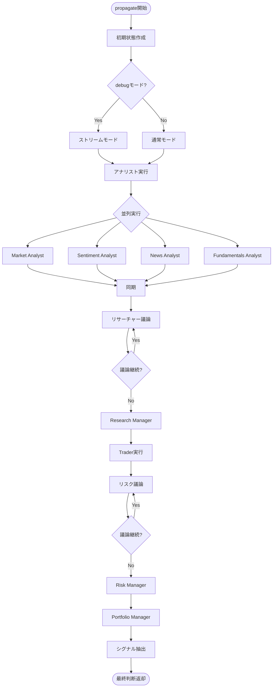
```mermaid
flowchart TD
    Start([propagate開始]) --> Init[初期状態作成]
    Init --> Debug{debugモード?}
    
    Debug -->|Yes| StreamMode[ストリームモード]
    Debug -->|No| InvokeMode[通常モード]
    
    StreamMode --> Analysts[アナリスト実行]
    InvokeMode --> Analysts
    
    Analysts --> Parallel{並列実行}
    Parallel --> MA[Market Analyst]
    Parallel --> SA[Sentiment Analyst]
    Parallel --> NA[News Analyst]
    Parallel --> FA[Fundamentals Analyst]
    
    MA --> Sync1[同期]
    SA --> Sync1
    NA --> Sync1
    FA --> Sync1
    
    Sync1 --> Debate[リサーチャー議論]
    Debate --> DebateCheck{議論継続?}
    DebateCheck -->|Yes| Debate
    DebateCheck -->|No| Manager[Research Manager]
    
    Manager --> Trader[Trader実行]
    Trader --> RiskDebate[リスク議論]
    RiskDebate --> RiskCheck{議論継続?}
    RiskCheck -->|Yes| RiskDebate
    RiskCheck -->|No| RiskMgr[Risk Manager]
    
    RiskMgr --> Portfolio[Portfolio Manager]
    Portfolio --> Extract[シグナル抽出]
    Extract --> End([最終判断返却])
```

### 議論ループの詳細

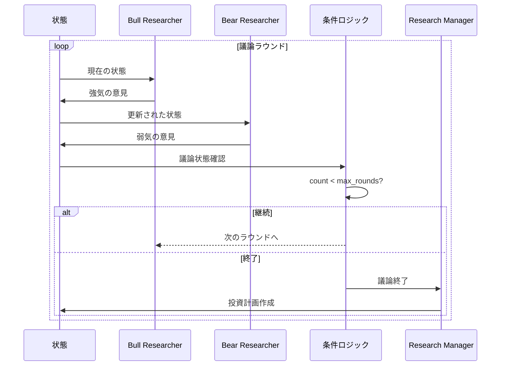
```mermaid
sequenceDiagram
    participant State as 状態
    participant Bull as Bull Researcher
    participant Bear as Bear Researcher
    participant Logic as 条件ロジック
    participant Manager as Research Manager
    
    loop 議論ラウンド
        State->>Bull: 現在の状態
        Bull->>State: 強気の意見
        
        State->>Bear: 更新された状態
        Bear->>State: 弱気の意見
        
        State->>Logic: 議論状態確認
        Logic->>Logic: count < max_rounds?
        
        alt 継続
            Logic-->>Bull: 次のラウンドへ
        else 終了
            Logic->>Manager: 議論終了
            Manager->>State: 投資計画作成
        end
    end
```

### エラーハンドリングフロー

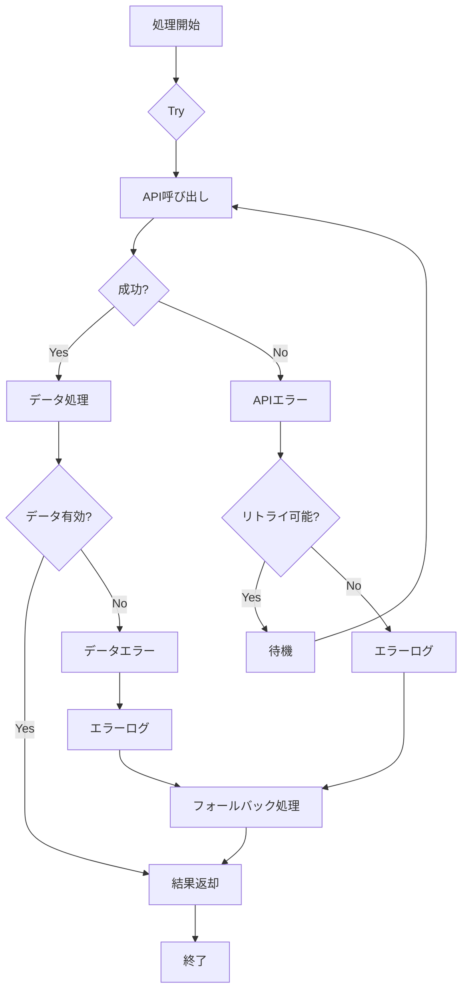
```mermaid
flowchart TD
    Start[処理開始] --> Try{Try}
    Try --> API[API呼び出し]
    
    API --> Success{成功?}
    Success -->|Yes| Process[データ処理]
    Success -->|No| Error1[APIエラー]
    
    Process --> Valid{データ有効?}
    Valid -->|Yes| Return[結果返却]
    Valid -->|No| Error2[データエラー]
    
    Error1 --> Retry{リトライ可能?}
    Retry -->|Yes| Wait[待機]
    Wait --> API
    Retry -->|No| Log1[エラーログ]
    
    Error2 --> Log2[エラーログ]
    
    Log1 --> Fallback[フォールバック処理]
    Log2 --> Fallback
    
    Fallback --> Return
    Return --> End[終了]
```

---

## コンポーネント間の依存関係

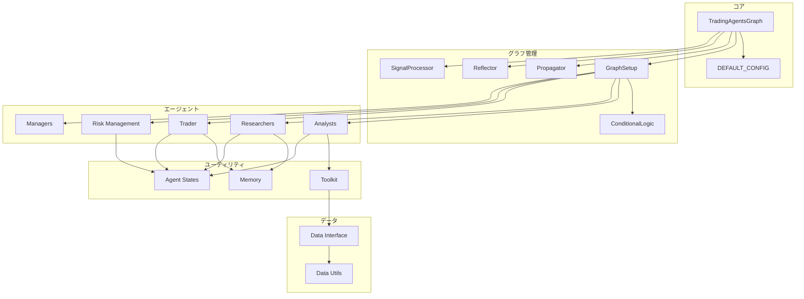
```mermaid
graph TD
    subgraph "コア"
        TG[TradingAgentsGraph]
        Config[DEFAULT_CONFIG]
    end
    
    subgraph "グラフ管理"
        Setup[GraphSetup]
        Prop[Propagator]
        Cond[ConditionalLogic]
        Ref[Reflector]
        Sig[SignalProcessor]
    end
    
    subgraph "エージェント"
        Analysts[Analysts]
        Researchers[Researchers]
        Trader[Trader]
        Risk[Risk Management]
        Managers[Managers]
    end
    
    subgraph "ユーティリティ"
        Memory[Memory]
        Toolkit[Toolkit]
        States[Agent States]
    end
    
    subgraph "データ"
        Interface[Data Interface]
        Utils[Data Utils]
    end
    
    TG --> Config
    TG --> Setup
    TG --> Prop
    TG --> Ref
    TG --> Sig
    
    Setup --> Cond
    Setup --> Analysts
    Setup --> Researchers
    Setup --> Trader
    Setup --> Risk
    Setup --> Managers
    
    Analysts --> Toolkit
    Analysts --> States
    Researchers --> Memory
    Researchers --> States
    Trader --> Memory
    Trader --> States
    Risk --> States
    
    Toolkit --> Interface
    Interface --> Utils
```

---

## デプロイメントアーキテクチャ

### ローカル実行

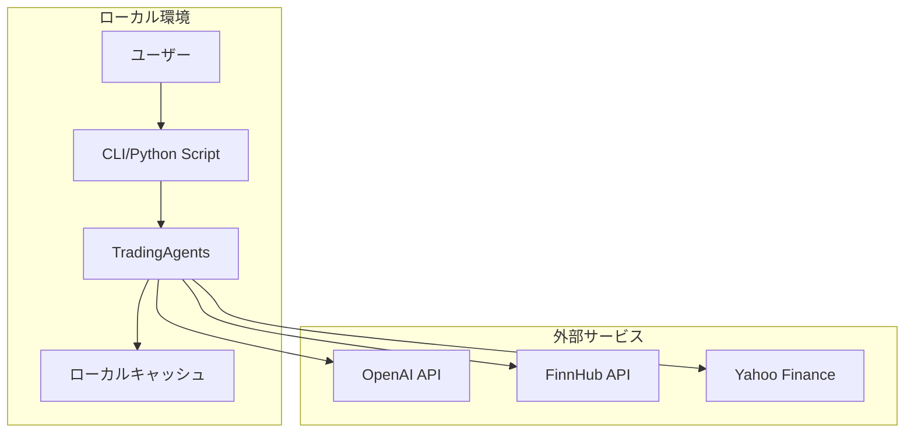
```mermaid
graph TB
    subgraph "ローカル環境"
        User[ユーザー]
        CLI[CLI/Python Script]
        App[TradingAgents]
        Cache[ローカルキャッシュ]
    end
    
    subgraph "外部サービス"
        OpenAI[OpenAI API]
        FinnHub[FinnHub API]
        YFin[Yahoo Finance]
    end
    
    User --> CLI
    CLI --> App
    App --> Cache
    App --> OpenAI
    App --> FinnHub
    App --> YFin
```

### スケーラブルデプロイメント（将来）

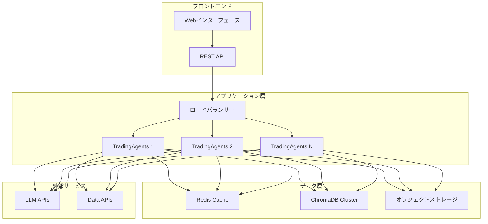
```mermaid
graph TB
    subgraph "フロントエンド"
        Web[Webインターフェース]
        API[REST API]
    end
    
    subgraph "アプリケーション層"
        LB[ロードバランサー]
        App1[TradingAgents 1]
        App2[TradingAgents 2]
        App3[TradingAgents N]
    end
    
    subgraph "データ層"
        Redis[Redis Cache]
        Chroma[ChromaDB Cluster]
        Storage[オブジェクトストレージ]
    end
    
    subgraph "外部サービス"
        LLM[LLM APIs]
        Data[Data APIs]
    end
    
    Web --> API
    API --> LB
    LB --> App1
    LB --> App2
    LB --> App3
    
    App1 --> Redis
    App2 --> Redis
    App3 --> Redis
    
    App1 --> Chroma
    App2 --> Chroma
    App3 --> Chroma
    
    App1 --> Storage
    App2 --> Storage
    App3 --> Storage
    
    App1 --> LLM
    App2 --> LLM
    App3 --> LLM
    
    App1 --> Data
    App2 --> Data
    App3 --> Data
```

---

## パフォーマンス考慮事項

### ボトルネック分析

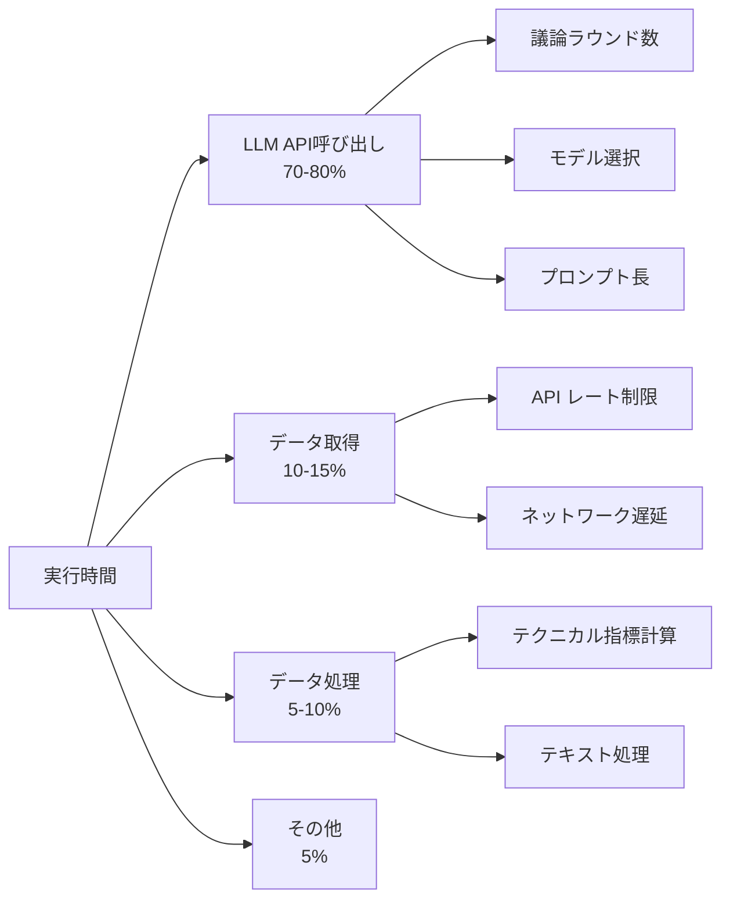
```mermaid
graph LR
    A[実行時間] --> B[LLM API呼び出し<br/>70-80%]
    A --> C[データ取得<br/>10-15%]
    A --> D[データ処理<br/>5-10%]
    A --> E[その他<br/>5%]
    
    B --> B1[議論ラウンド数]
    B --> B2[モデル選択]
    B --> B3[プロンプト長]
    
    C --> C1[API レート制限]
    C --> C2[ネットワーク遅延]
    
    D --> D1[テクニカル指標計算]
    D --> D2[テキスト処理]
```

### 最適化戦略

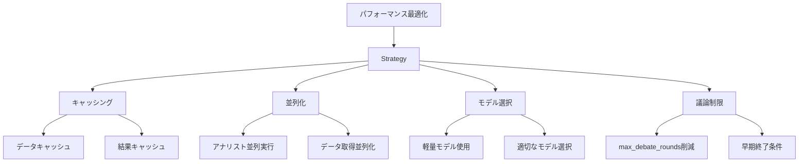
```mermaid
graph TD
    Start[パフォーマンス最適化] --> Strategy
    
    Strategy --> S1[キャッシング]
    Strategy --> S2[並列化]
    Strategy --> S3[モデル選択]
    Strategy --> S4[議論制限]
    
    S1 --> S1A[データキャッシュ]
    S1 --> S1B[結果キャッシュ]
    
    S2 --> S2A[アナリスト並列実行]
    S2 --> S2B[データ取得並列化]
    
    S3 --> S3A[軽量モデル使用]
    S3 --> S3B[適切なモデル選択]
    
    S4 --> S4A[max_debate_rounds削減]
    S4 --> S4B[早期終了条件]
```

---

## セキュリティアーキテクチャ

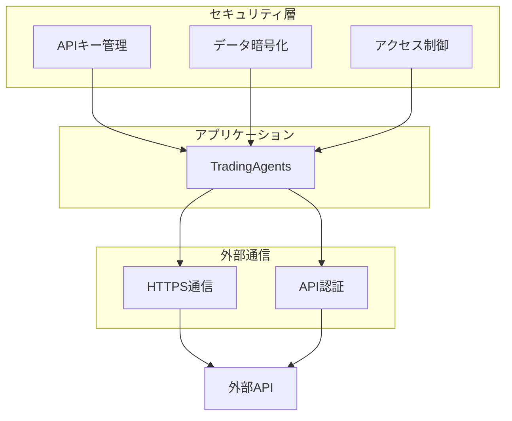
```mermaid
graph TB
    subgraph "セキュリティ層"
        A[APIキー管理]
        B[データ暗号化]
        C[アクセス制御]
    end
    
    subgraph "アプリケーション"
        D[TradingAgents]
    end
    
    subgraph "外部通信"
        E[HTTPS通信]
        F[API認証]
    end
    
    A --> D
    B --> D
    C --> D
    
    D --> E
    D --> F
    
    E --> G[外部API]
    F --> G
```

---

このアーキテクチャドキュメントは、TradingAgentsの技術的な構造を理解するための包括的なガイドです。各図は、システムの異なる側面を視覚化しています。

詳細な実装については、[開発者ガイド](DEVELOPER_GUIDE.ja.md)を参照してください。

